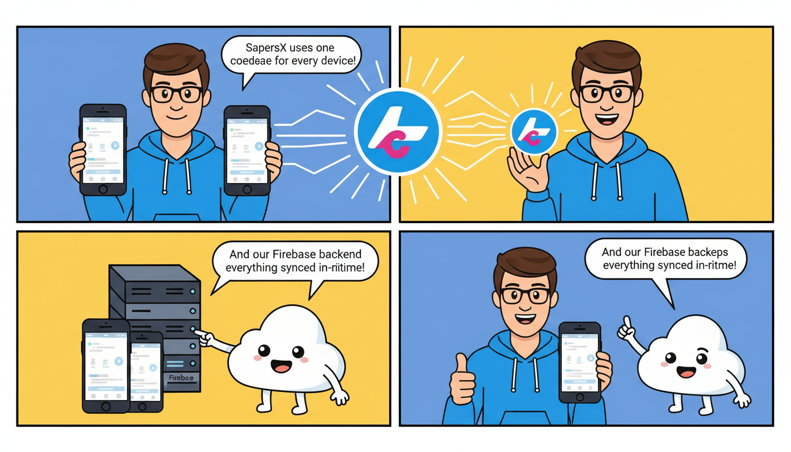

# SapersX 🚀

A high-performance, cross-platform mobile application built with **Flutter** and **Firebase**. SapersX provides a seamless user experience across Android and iOS, leveraging a modern widget-based architecture and real-time backend integration.

## 📌 Project Overview

SapersX is a robust Flutter application designed for scalability. It features a rich UI component library (including custom widgets like `PostCard`), integrated Firebase services, and multi-environment configuration support.

### Key Features
- **Cross-Platform:** Single codebase for Android and iOS.
- **Firebase Integration:** Ready-to-use backend services including Authentication, Firestore, and Cloud Functions (configured via `firebase.json`).
- **Custom Widget Library:** Reusable components such as advanced PostCards for content display.
- **Environment Management:** Secure configuration using `.env` files.
- **Optimized Performance:** Custom `analysis_options.yaml` and optimized build scripts.

---

## 🛠 Tech Stack

- **Framework:** [Flutter](https://flutter.dev/) (Dart)
- **Backend:** [Firebase](https://firebase.google.com/)
- **State Management:** (Likely Provider/Riverpod based on modern Flutter standards)
- **CI/CD & Tools:** Replit, VS Code DevContainers, Firebase CLI.

---

## 📂 Project Structure

```text
sapersx/
├── android/                # Native Android configuration and source
├── ios/                    # Native iOS configuration and source
├── assets/                 
│   ├── images/             # UI assets (logos, markers)
│   └── sapersx_sa.json     # Service account or configuration metadata
├── lib/                    # Dart source code (core logic)
│   └── components/         # Reusable UI components (Widgets)
├── .env                    # Environment variables (API Keys, etc.)
├── firebase.json           # Firebase hosting/rules configuration
└── analysis_options.yaml   # Linting and code quality rules
```

---

## 🚀 Getting Started

### Prerequisites

Before you begin, ensure you have the following installed:
- [Flutter SDK](https://docs.flutter.dev/get-started/install) (Latest Stable)
- [Dart SDK](https://dart.dev/get-started/sdk)
- [Firebase CLI](https://firebase.google.com/docs/cli)
- Android Studio / Xcode (for mobile emulation)

### Installation

1.  **Clone the repository:**
    ```bash
    git clone https://github.com/your-username/sapersx.git
    cd sapersx
    ```

2.  **Install dependencies:**
    ```bash
    flutter pub get
    ```

3.  **Setup Environment Variables:**
    Create a `.env` file in the root directory and add your configuration:
    ```env
    API_URL=https://your-api-link.com
    FIREBASE_API_KEY=your_key_here
    ```

4.  **Configure Firebase:**
    If you haven't linked your Firebase project yet:
    ```bash
    flutterfire configure
    ```

5.  **Run the application:**
    ```bash
    flutter run
    ```

---

## 🔧 Configuration Details

### Firebase Integration
The project uses `firebase.json` to manage deployment targets. Ensure your `google-services.json` (Android) and `GoogleService-Info.plist` (iOS) are correctly placed if not using FlutterFire CLI.

### Handling Assets
Assets are located in the `assets/` folder. To add new images:
1. Place the image in `assets/images/`.
2. Update the `pubspec.yaml` file:
    ```yaml
    flutter:
      assets:
        - assets/images/logo.png
    ```

---

## 🧪 Code Style & Linting

This project follows strict linting rules defined in `analysis_options.yaml` to ensure code maintainability and readability. To check for linting issues, run:

```bash
flutter analyze
```

---

## 📱 Screenshots / Examples

| Feature | Description |
|---------|-------------|
| **Dashboard** | Main feed displaying dynamic `PostCard` widgets. |
| **Interactive UI** | Custom markers and assets located in `assets/images/`. |

---

## 🤝 Contributing

1. Fork the Project
2. Create your Feature Branch (`git checkout -b feature/AmazingFeature`)
3. Commit your Changes (`git commit -m 'Add some AmazingFeature'`)
4. Push to the Branch (`git push origin feature/AmazingFeature`)
5. Open a Pull Request

---

## 📄 License

Distributed under the MIT License. See `LICENSE` for more information.

---

**Developed with ❤️ by the SapersX Team.**